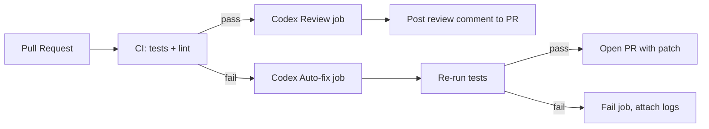

# Integrating Codex CLI into a Maintainable SDLC for a Modular Monolith

## Executive summary

This report integrates **Codex CLI** into the long-term SDLC you previously requested, focusing on a **personal/small-team (assumed 1–3 developers)** finance + dev application built as a **modular monolith** (single repo, single deployment, single database) while remaining general enough to apply to other domains and to support future service extraction. Codex CLI is **an OpenAI coding agent that runs locally in your terminal**, with the ability to **read, change, and run code** in a chosen directory; it is **open source** and designed to support agentic workflows. citeturn2view0turn6view3

The most robust SDLC pattern for integrating agentic code generation is to treat Codex as **an automation tool that produces proposals under explicit constraints**, rather than as an autonomous committer. Practically, this means:

- Standardise “how Codex behaves” via **AGENTS.md** (layered repo guidance), **project-scoped config**, and optionally **skills** and **custom prompts**. citeturn9view0turn9view2turn9view4turn16view2  
- Use **non-interactive mode (`codex exec`)** in CI and scripting with least-privilege sandboxing, machine-readable outputs (JSONL and/or output-schema), and strict gating (PR-only, no silent merges). citeturn9view1turn16view1turn10search0turn11view1  
- Harden security with **sandbox + approvals + rules**, minimal GitHub workflow permissions, safe secret handling, and prompt-injection defences. citeturn6view0turn11view0turn1search1turn11view1turn16view3  
- Make runs auditable by capturing Codex JSONL event streams + output artefacts + provenance metadata (hashes, pinned versions, prompts/inputs). citeturn16view1turn1search3turn11view1

Top recommendations (with effort/benefit)

- **Adopt “Codex-as-proposer” by default (PR gating; no auto-commit/auto-merge)**.  
  Rationale: aligns with security guidance for Codex GitHub Action (limit triggers; protect secrets; run with constrained privileges). Trade-off: slightly slower; requires review discipline. Effort: Medium. Benefit: High. citeturn11view1turn1search1  
- **Codify operating constraints via AGENTS.md + project `.codex/config.toml`** (module boundaries, security rules, tests, migration discipline).  
  Rationale: Codex reads AGENTS.md before doing work and merges instructions from root to the current directory. Trade-off: requires keeping guidance up to date. Effort: Low–Medium. Benefit: High. citeturn9view0turn9view2  
- **Use `codex exec --json` + `--output-schema` for reproducible CI integration** (structured triage summaries, risk reports, release notes, migration checklists).  
  Rationale: Codex supports JSONL event streams and schema-constrained final outputs; GitHub Action supports output capture and structured outputs via `--output-schema`. Trade-off: schema/prompt maintenance. Effort: Medium. Benefit: High. citeturn16view1turn10search1turn10search0  
- **Pin versions (Codex CLI + model + prompts)** and record provenance for every CI invocation.  
  Rationale: action supports `codex-version`; docs emphasise version-specific outputs (e.g., schema bundles) and provide explicit maturity labels. Trade-off: periodic upgrades. Effort: Low–Medium. Benefit: High. citeturn11view1turn16view0turn6view1  

## Codex CLI capabilities and how they map to SDLC

### Scope and objectives

This report aims to:

- Explain what Codex CLI is and what it can do, based on official documentation. citeturn2view0turn16view1  
- Provide step-by-step integration for local development and CI/CD (GitHub Actions primary), with Django and FastAPI modular-monolith examples. citeturn11view1turn9view1turn9view2  
- Cover security: credential handling, least privilege, audit logging, token rotation guidance, and supply-chain implications (including provenance). citeturn12search0turn11view1turn1search3  
- Provide copy-paste artefacts: prompts/templates, AGENTS.md, config snippets, GitHub Actions YAML, pre-commit hooks, structured logging and provenance schemas, and rollback playbooks. citeturn11view1turn16view1turn1search2  

### Key attributes and dimensions assumed

- Team size: **1–3 initially**.  
- Baseline architecture: **modular monolith** (single repo, single DB).  
- Target stacks: examples for **Django** and **FastAPI** backends; brief **Next.js** touchpoints where helpful.  
- CI/CD: **GitHub Actions** primary; GitLab CI discussed as optional because OpenAI provides relevant cookbook patterns. citeturn14view2  
- Security posture: finance implies higher sensitivity; use conservative defaults (sandboxing, approvals, least privilege). citeturn6view0turn11view1  
- Licensing/cost: Codex CLI is open source (Apache-2.0), but usage depends on ChatGPT plan limits or API-key billing; official pricing describes plan limits and usage-based API access. citeturn6view3turn6view2turn12search0  

### What Codex CLI is (official definition)

Codex CLI is **OpenAI’s coding agent** that you run locally in your terminal. It can **inspect your repository, edit files, and run commands** in the selected directory, and it is **open source**. citeturn2view0turn6view3

Operationally, Codex supports two primary modes:

- **Interactive TUI**: a full-screen terminal UI for conversational workflows with real-time review. citeturn2view4turn15search3  
- **Non-interactive (`codex exec`)**: a headless/script-friendly mode for CI and automation, with explicit sandbox/approval settings and machine-readable output options. citeturn9view1turn3view2turn16view1  

Capabilities explicitly documented as SDLC-relevant include:

- Debugging failures and proposing fixes; automating repetitive workflows like refactoring, testing, migrations, and setup tasks. citeturn4view3turn9view1  
- Running Codex in GitHub Actions via the official **Codex GitHub Action** (`openai/codex-action@v1`) to post reviews, gate checks, or automate tasks. citeturn11view1turn13view0  
- Producing structured outputs via JSON schema validation in `codex exec`, and emitting detailed JSONL event streams (including file changes, command executions, MCP tool calls). citeturn16view1turn10search0  
- Constraining behaviour using layered **AGENTS.md**, project config, security sandboxing/approvals, and command execution rules. citeturn9view0turn6view0turn11view0turn9view2  

Capabilities that are **not** described as dedicated “Codex CLI features” in official docs (therefore treated here as **prompted workflows**, not built-in subcommands) include: “generate DTOs”, “scaffold Django apps”, “write ADRs” as named commands. The correct interpretation is: Codex can create these outcomes because it can read/edit files and run commands, but you implement them via **prompts, templates, and skills**. citeturn2view0turn9view4turn16view1  

image_group{"layout":"carousel","aspect_ratio":"16:9","query":["Codex CLI terminal UI screenshot","openai codex action github pull request review screenshot","OpenAI Codex AGENTS.md documentation screenshot","Codex CLI sandbox approvals diagram"],"num_per_query":1}

## SDLC integration model for Codex CLI

### Design principle: Codex as a constrained agent inside your SDLC loop

The stable pattern is:

1. **Human defines constraints** (AGENTS.md, prompts, schemas, rules). citeturn9view0turn16view2turn11view0  
2. **Codex proposes changes inside the constraints** (local or CI). citeturn2view0turn9view1  
3. **Pipeline verifies** (tests, linters, migrations), generates artefacts (diffs, reports), and gates merges via PR review. citeturn14view0turn1search1  
4. **Audit and provenance recorded** (JSONL logs + metadata + pinned versions). citeturn16view1turn1search3turn11view1  

This is consistent with how OpenAI’s official cookbook examples integrate Codex into CI: run Codex, verify tests, then open a PR rather than pushing directly to main. citeturn14view0

### Two recommended adoption tracks (restrictive vs permissive)

| Strategy | What you allow Codex to do | Where it runs | Typical use cases | Costs/risks | Effort | Long-term benefit |
|---|---|---|---|---|---|---|
| Restrictive (recommended baseline) | Read-only analysis, reviews, risk reports, structured suggestions; no file writes in CI | Local interactive; CI read-only | PR review comments; release notes; migration checklists; security triage summaries | Lowest risk; may miss “autofix” speed-ups | Low–Medium | High (safe learning curve) citeturn6view0turn16view1turn11view1 |
| Permissive (controlled automation) | File edits and scripted fixes; opens PRs automatically; no direct main merges | CI “workspace-write” with safeguards | Auto-fix failing tests; generate scaffolding; code mod PRs | Higher risk: prompt injection, secret exfiltration, unwanted changes | Medium–High | Medium–High (if well governed) citeturn14view0turn11view1turn6view0 |

## Local developer workflows and repository conventions

### Installation and local setup

Codex CLI can be installed via npm (and also Homebrew per official quickstart). You authenticate with ChatGPT or an API key. citeturn2view0turn4view0turn12search0

**Practical recommendation (small team): standardise a “Codex local profile”**  
Rationale: consistent safety settings across developers; fewer accidental permission escalations. Trade-off: some setup overhead. Effort: Low. Benefit: High. citeturn9view2turn6view0turn9view3  

Example project-scoped config placed at `.codex/config.toml` (loaded only for trusted projects): citeturn9view2turn12search7

```toml
# .codex/config.toml (project-scoped)
# Conservative defaults for a finance-sensitive codebase.
approval_policy = "untrusted"       # ask before running “untrusted” commands
sandbox_mode = "workspace-write"    # allow edits in workspace; no network by default

[sandbox_workspace_write]
network_access = false              # keep outbound network off unless needed
```

This maps directly to the official configuration model (approval policies, sandbox modes, and network access toggles). citeturn9view3turn6view0turn12search2

### Credential handling in local development

Codex supports signing in via ChatGPT (subscription access) or API key (usage-based). It caches login details either in a plaintext file (`~/.codex/auth.json`) or your OS credential store. You can control the storage method via `cli_auth_credentials_store`. citeturn12search0turn12search1

For a finance-sensitive project, prefer `keyring` storage where possible:

```toml
# ~/.codex/config.toml
cli_auth_credentials_store = "keyring"   # file | keyring | auto
```

This is directly supported by Codex authentication settings. citeturn12search0

### Make Codex predictable: AGENTS.md as “policy + conventions”

Codex reads `AGENTS.md` before doing work and builds an **instruction chain** from global guidance (in `~/.codex`) and project guidance (walking from repo root down to the current working directory). Files closer to the working directory override earlier guidance. citeturn9view0

**Recommendation: treat AGENTS.md as the contract between your SDLC and Codex**  
Rationale: reduces prompt drift; makes results consistent; encodes security and architectural constraints. Trade-off: must keep it current. Effort: Low. Benefit: High. citeturn9view0turn4view2  

A practical `AGENTS.md` template (top-level, repo root):

```text
# Working agreements (Codex)

## Safety & security
- Never log secrets, tokens, or PII.
- Treat finance data as sensitive: minimise exposure in test fixtures and logs.
- Avoid network access unless explicitly requested and justified.
- Do not introduce new production dependencies without asking.

## Architecture & modular monolith boundaries
- Keep module boundaries: finance/, dev/, core/.
- Do not bypass module APIs (no cross-domain writes).
- Prefer DTOs at boundaries; do not leak internal models into API responses.

## Quality gates
- After making changes, run unit tests and integration tests.
- Keep changes minimal; avoid unrelated refactors.
- If a migration is needed, include it and explain why.

## Review guidelines (for PR reviews)
- Flag P0/P1 security issues.
- Verify auth middleware wraps all routes.
- Flag any behaviour that could cause duplicate financial transactions.
```

This aligns with official guidance that Codex uses AGENTS.md for review guidelines in GitHub PR reviews, and that you can tailor it to prioritise specific issues. citeturn4view2turn9view0

### Reusable prompts and skills: “templatise your Codex work”

Codex supports **custom prompts** stored as top-level Markdown files under `~/.codex/prompts/` and invoked via slash commands (e.g., `/prompts:draftpr ...`). citeturn16view2turn15search6

Codex also supports **agent skills**: a skill is a directory with `SKILL.md` plus optional scripts and references; skills can be invoked explicitly or implicitly, and Codex provides a built-in `$skill-creator`. citeturn9view4

**Recommendation: use skills for repeatable, high-risk workflows** (migrations, scaffolding, security triage)  
Rationale: skills package instructions and templates so the agent follows a known workflow reliably. Trade-off: upfront authoring. Effort: Medium. Benefit: High. citeturn9view4turn6view1  

Example skill skeleton you can commit to your repo (project-local skills repository; you can store these under `skills/`):

```text
skills/
  scaffold-module/
    SKILL.md
    assets/
      django_app_template/
      fastapi_module_template/
```

Example `SKILL.md` (high-level):

```markdown
---
name: scaffold-module
description: Create a new domain module using our modular monolith conventions. Do not modify existing modules unless requested.
---

Steps:
1) Ask for module name and stack (Django or FastAPI).
2) Generate module folder structure from assets templates.
3) Add minimal wiring (urls/router include) and placeholder tests.
4) Run unit tests and lint.
5) Output a summary + files changed.
```

The skill structure matches the official skills format and invocation model. citeturn9view4

### Example local commands for SDLC tasks (copy-paste prompts)

These are **prompted workflows** using `codex exec` (non-interactive) so you can standardise behaviour and capture outputs. Codex explicitly supports `codex exec` for scripted runs and can write the final message to a file and/or emit JSONL. citeturn9view1turn16view1turn10search0

**Scaffold a new module (Django example)** *(prompted workflow; not a built-in “scaffold” command)*:

```bash
codex exec --full-auto \
  "Create a new Django app module named 'finance' in backend/finance following our repo conventions.
   Include: apps.py, domain/, services/, api/, migrations/, and unit tests.
   Wire URLs under config/urls.py. Keep changes minimal and run tests." \
  -o codex-scaffold-finance.md
```

**Generate DTOs + OpenAPI stubs (FastAPI example)** *(prompted workflow; boundaries via Pydantic)*:

```bash
codex exec --full-auto \
  "In backend/app/finance, add Pydantic schemas for CreateTransactionRequest and TransactionDTO.
   Update/ add an APIRouter endpoint stub for POST /finance/transactions.
   Add a minimal OpenAPI description in the route docstring. Run tests." \
  -o codex-finance-dtos.md
```

**Produce an ADR for an architectural decision** *(prompted workflow; outputs markdown)*:

```bash
codex exec \
  "Draft an ADR in docs/adr/ for 'Idempotency keys for finance transaction creation'.
   Include context, decision, alternatives, consequences, and migration plan.
   Do not modify code." \
  -o docs/adr/0001-idempotency.md
```

Codex exec is explicitly designed for pipeline-style automation and can be run read-only by default; use `--full-auto` only when you intend file edits. citeturn9view1turn16view1turn6view0

### Pre-commit integration (safe, reviewable)

The pre-commit framework is configured via `.pre-commit-config.yaml`. You can define local hooks and control whether filenames are passed to the hook. citeturn1search2turn17search0

Because Codex CLI may require network/model access and can be slow, the conservative approach is: **do not run Codex automatically on every commit**. Instead, add a **manual hook** (invoked explicitly) that generates a report file in a predictable location, which your PR process can review.

Example `.pre-commit-config.yaml` local hook (manual invocation pattern):

```yaml
repos:
  - repo: local
    hooks:
      - id: codex-risk-report
        name: Codex risk report (manual)
        entry: bash -lc 'codex exec --json "Summarise risks in the staged changes. Focus on security, migrations, and finance correctness." -o artifacts/codex-risk-report.json'
        language: system
        pass_filenames: false
```

This uses pre-commit’s configuration model (local hooks, `pass_filenames`) and Codex exec’s JSON/`-o` output options. citeturn17search0turn16view1turn10search0  

Operationally, you run it manually when needed:

```bash
pre-commit run codex-risk-report --all-files
```

## CI/CD integration with GitHub Actions and deployment workflows

### Core CI pattern: Codex as a gated, least-privilege CI step

OpenAI provides an official GitHub Action (`openai/codex-action@v1`) that installs Codex CLI, starts a Responses API proxy when you provide an API key, and runs `codex exec` under specified permissions and sandbox settings. citeturn2view1turn11view1

The official example workflow shows:

- Checkout code
- Run Codex with a prompt file
- Capture output to a file
- Post feedback to the PR as a comment citeturn13view0

#### Example GitHub Actions workflow: Codex PR review (official structure, adapted)

This is based on the documented example and is suitable as a first integration because it does not require auto-committing changes. citeturn13view0turn11view1  

```yaml
name: codex-pr-review

on:
  pull_request:
    types: [opened, synchronize, reopened]

jobs:
  codex:
    runs-on: ubuntu-latest
    permissions:
      contents: read
      pull-requests: write
    outputs:
      final_message: ${{ steps.run_codex.outputs.final-message }}
    steps:
      - uses: actions/checkout@v5
        with:
          ref: refs/pull/${{ github.event.pull_request.number }}/merge

      - name: Run Codex review
        id: run_codex
        uses: openai/codex-action@v1
        with:
          openai-api-key: ${{ secrets.OPENAI_API_KEY }}
          prompt-file: .github/codex/prompts/review.md
          output-file: codex-output.md
          safety-strategy: drop-sudo
          sandbox: workspace-write

      - name: Upload Codex output
        uses: actions/upload-artifact@v4
        with:
          name: codex-output
          path: codex-output.md

  post_feedback:
    runs-on: ubuntu-latest
    needs: codex
    if: needs.codex.outputs.final_message != ''
    permissions:
      pull-requests: write
    steps:
      - name: Post Codex feedback
        uses: actions/github-script@v7
        with:
          github-token: ${{ github.token }}
          script: |
            await github.rest.issues.createComment({
              owner: context.repo.owner,
              repo: context.repo.repo,
              issue_number: context.payload.pull_request.number,
              body: process.env.CODEX_FINAL_MESSAGE,
            });
        env:
          CODEX_FINAL_MESSAGE: ${{ needs.codex.outputs.final_message }}
```

This follows the action’s documented inputs (`openai-api-key`, `prompt-file`, `output-file`, `sandbox`, `safety-strategy`) and uses GitHub Actions permissions with explicit scoping. citeturn13view0turn11view1turn1search1

### CI gating for generated code and “autofix” workflows

OpenAI provides a cookbook showing how to run Codex in GitHub Actions upon CI failures, have Codex propose fixes, re-run tests, and then create a PR—explicitly keeping changes “minimal and surgical”. citeturn14view0turn16view1

**Recommendation: auto-fix should open PRs, not push to main**  
Rationale: retains human check; reduces risk of silent regressions. Trade-off: PR review overhead. Effort: Medium. Benefit: High. citeturn14view0turn11view1  

A simplified “CI autofix opens PR” example (conceptually aligned with the cookbook; adapt commands to Django/FastAPI):

```yaml
name: codex-autofix-ci

on:
  workflow_run:
    workflows: ["ci"]
    types: [completed]

jobs:
  codex_autofix:
    if: ${{ github.event.workflow_run.conclusion == 'failure' }}
    runs-on: ubuntu-latest
    permissions:
      contents: write
      pull-requests: write
    steps:
      - uses: actions/checkout@v5
        with:
          ref: ${{ github.event.workflow_run.head_branch }}

      - name: Run Codex to fix CI
        id: codex
        uses: openai/codex-action@v1
        with:
          openai-api-key: ${{ secrets.OPENAI_API_KEY }}
          prompt: >
            You are working in a modular monolith repo. Run the backend tests.
            Identify the minimal change needed to make tests pass.
            Implement only that change. Do not refactor unrelated code.
          codex-args: '["--full-auto"]'
          sandbox: workspace-write
          safety-strategy: drop-sudo

      - name: Verify tests
        run: |
          # Django example:
          python -m pytest -q

      - name: Create PR with fixes
        uses: peter-evans/create-pull-request@v6
        with:
          commit-message: "fix(ci): codex auto-fix failing tests"
          title: "Codex auto-fix CI failure"
          body: |
            Codex generated this PR in response to a failing CI run.
            Please review carefully; changes should be minimal.
```

This mirrors the cookbook’s overall flow (Codex proposes fix, verify tests, open PR). citeturn14view0  
Security note: use GitHub’s workflow hardening guidance before granting write permissions to workflows; minimise permissions and review third-party actions. citeturn1search1

### Integrating Codex into deployment workflows

Codex’s official positioning includes automating tasks like migrations and setup, and `codex exec` supports explicit sandbox/approval configurations. citeturn4view3turn9view1turn6view0

For a modular monolith, initial deployment workflows should use Codex primarily as:

- A **release assistant**: generate release notes, regression checklists, migration summaries. citeturn9view1turn16view1  
- A **pre-deploy risk reviewer**: produce a structured “go/no-go” report output constrained by schema. citeturn16view1turn10search0  

Example: generate release notes from the last 10 commits (official example pattern):

```bash
codex exec "generate release notes for the last 10 commits" | tee release-notes.md
```

This is explicitly supported usage in non-interactive mode docs. citeturn9view1

## Security, secrets, auditability, and operational controls

### Authentication, credentials, and least privilege

Codex supports ChatGPT sign-in or API key sign-in; cloud usage has specific requirements, and local CLI/IDE caching behaviour is documented (auth.json or OS credential store). citeturn12search0turn4view0

In CI, official guidance is to store your OpenAI key as a GitHub secret (e.g., `OPENAI_API_KEY`) and reference it in workflows. citeturn11view1turn1search0  
GitHub’s own security guidance emphasises secure workflow practices and least privilege permissions. citeturn1search1

Special CI detail: in non-interactive mode docs, `CODEX_API_KEY` is supported **only in `codex exec`** and is intended for CI-style explicit credential provision. citeturn16view1

**Recommended practice (finance-sensitive defaults)**  
Rationale: reduce exfiltration impact and make compromise response manageable. Trade-off: operational overhead (rotation, scoping). Effort: Medium. Benefit: High. citeturn1search0turn11view1turn16view1  

Concrete steps:

- Store the key only in GitHub Secrets (or a secrets manager if you have one); do not echo it. citeturn1search0turn1search1  
- Restrict workflow permissions; default to read-only and grant write only to PR-creation jobs. citeturn1search1turn11view1  
- Use Codex Action’s privilege controls (`drop-sudo`, unprivileged user) when available. citeturn11view1  

### Sandbox and approvals: constrain what Codex can do

Codex security controls combine:

- **Sandbox mode** (what it can do technically: write roots, network access, etc.)
- **Approval policy** (when it must ask) citeturn12search2turn6view0  

Official “common combinations” include read-only CI mode and workspace-write mode with approvals; `--full-auto` is a convenience alias for workspace-write + on-request approvals. citeturn6view0turn3view2

Key operational guidance:

- `codex exec` defaults to **read-only sandbox**, and you should set the least permissions needed in automation. citeturn16view1turn9view1  
- Avoid `--yolo` / bypass approvals except in isolated environments; official docs explicitly warn it is dangerous. citeturn3view2turn6view0  
- Prefer granting extra writable dirs via `--add-dir` rather than switching to `danger-full-access`. citeturn7view0  

### Rules and execpolicy: defend against dangerous command execution

Codex supports **rules** to control which commands can run outside the sandbox. Rules are experimental; they can allow/prompt/forbid command prefixes and include inline match/not_match validation examples. citeturn11view0turn6view1  
You can test rules with `codex execpolicy check`, which outputs JSON showing the strictest decision and matching rules. citeturn11view0turn7view1

This is highly relevant to finance sensitivity because it lets you forbid destructive operations (e.g., dangerous git operations, credential-exposing commands) even if a prompt is compromised. citeturn11view0turn16view3

Example restrictive rules file (conceptual):

```python
# ~/.codex/rules/default.rules

# Forbid destructive filesystem deletion outside sandbox.
prefix_rule(
  pattern=["rm", "-rf"],
  decision="forbidden",
  justification="Forbidden. Use safer cleanup scripts with explicit allowlists."
)

# Prompt before git push.
prefix_rule(
  pattern=["git", "push"],
  decision="prompt",
  justification="Pushing changes requires explicit approval."
)
```

Rules are loaded at startup and are intentionally designed to be safe to run (Starlark rules engine). citeturn11view0

### Prompt injection: guardrails for PR and web inputs

The Codex GitHub Action security checklist explicitly warns to sanitise prompt inputs from pull requests, commit messages, issue bodies, and hidden text to avoid prompt injection. citeturn11view1  
Codex cloud internet access guidance provides a concrete prompt injection example and enumerates risks such as exfiltration, malware download, and licence issues. citeturn16view3

Practical mitigations:

- Do not feed untrusted free-text (issue bodies, PR descriptions) directly into Codex prompts without sanitisation. citeturn11view1turn16view3  
- Keep network access off by default; enable only when necessary and restrict domains/methods (where applicable). citeturn12search2turn16view3  
- Restrict who can trigger Codex workflows (deny forks; allow only trusted users). citeturn11view1  

### Supply-chain and provenance considerations

Codex CLI is open source (Apache-2.0), which supports auditing and pinning. citeturn6view3  
For supply-chain traceability, SLSA defines provenance as verifiable metadata describing where/when/how an artefact was produced. citeturn1search3  
For broader secure software development practice integration, NIST SSDF provides a high-level framework for mitigating software vulnerability risk across the SDLC. citeturn10search1

**Recommendation: instrument Codex runs like a build step** (inputs, versions, hashes)  
Rationale: reproducibility and auditability; reduces “mystery codegen” risk. Trade-off: bookkeeping overhead. Effort: Medium. Benefit: High. citeturn1search3turn16view1turn11view1  

## Auditability and observability plan for Codex CLI usage

### Capture outputs: JSONL streams + schema-constrained final artefacts

Non-interactive mode supports:

- `--json` to emit a JSONL stream of events (thread/turn lifecycle, command execution, file changes, MCP tool calls, usage). citeturn16view1  
- `--output-schema` to request a final response conforming to a JSON Schema, and `-o/--output-last-message` to write the final message to a file. citeturn16view1turn10search0  

The Codex GitHub Action also:
- emits `final-message` output,
- supports saving output to `output-file`,
- recommends `--output-schema` for structured data. citeturn10search1turn11view1  

### Example provenance metadata schema for generated artefacts

This is a project-owned schema you can use to track reproducibility.

```json
{
  "schema_version": "1.0",
  "tool": {
    "name": "codex-cli",
    "pinned_cli_version": "vX.Y.Z",
    "model": "gpt-5.2-codex",
    "profile": "ci-review"
  },
  "run": {
    "timestamp_utc": "2026-02-10T00:00:00Z",
    "runner": "github-actions",
    "job_id": "123456789",
    "workflow": "codex-pr-review",
    "actor": "user_or_bot",
    "repo": "owner/repo",
    "git": {
      "base_sha": "abc...",
      "head_sha": "def..."
    }
  },
  "inputs": {
    "prompt_file": ".github/codex/prompts/review.md",
    "prompt_sha256": "…",
    "agents_md_sha256": "…",
    "rules_sha256": "…",
    "output_schema_file": "schemas/codex_review.schema.json"
  },
  "policy": {
    "sandbox": "workspace-write",
    "approval_policy": "untrusted",
    "network_access": false
  },
  "outputs": {
    "final_message_file": "codex-output.md",
    "jsonl_log_file": "codex-events.jsonl",
    "files_changed": ["..."],
    "artifacts_sha256": {
      "codex-output.md": "…",
      "codex-events.jsonl": "…"
    }
  }
}
```

This aligns with the documented ability to pin versions (`codex-version`), capture outputs, and use structured schema validation. citeturn11view1turn16view1turn6view1

### Example structured log event for Codex invocation

Codex exec JSONL event streams include usage fields and item events; you can adapt them into your application’s structured logging format. citeturn16view1turn10search0

Example “wrapper log event” you emit from CI (your own log format):

```json
{
  "ts": "2026-02-10T12:34:56.789Z",
  "level": "INFO",
  "event": "codex.exec.completed",
  "component": "ci",
  "sandbox": "read-only",
  "approval_policy": "never",
  "prompt": ".github/codex/prompts/review.md",
  "codex_cli_version": "vX.Y.Z",
  "model": "gpt-5.2-codex",
  "result": "success",
  "usage": {
    "input_tokens": 24763,
    "cached_input_tokens": 24448,
    "output_tokens": 122
  }
}
```

The usage structure and JSONL event stream support are documented for `codex exec --json`. citeturn16view1

### Suggested Prometheus metrics for Codex SDLC integration

Since Codex exec provides machine-readable event streams including completion/failure events and usage, you can derive the following metrics:

- `codex_exec_runs_total{mode="ci|local", sandbox="read-only|workspace-write"}`  
- `codex_exec_failures_total{reason="schema_violation|policy_blocked|test_failed"}`  
- `codex_exec_tokens_total{type="input|output|cached"}`  
- `codex_exec_duration_seconds_bucket` (histogram)  

The justification is that Codex provides a structured execution stream and usage data suitable for automated parsing and downstream reporting. citeturn16view1turn10search0

## Governance, decision matrices, rollback/reproducibility, and next steps

### Governance checklist (policy you can adopt immediately)

This policy is designed to be conservative for a finance domain:

- **Default behaviour:** Codex may propose changes; merges require human review. citeturn11view1turn14view0  
- **Auto-commit:** allowed only on disposable branches created by CI; never directly to main. citeturn14view0  
- **Workflow triggers:** restrict to trusted actors; do not allow arbitrary PR authors to trigger Codex with write permissions. citeturn11view1turn1search1  
- **Prompt and guideline governance:** AGENTS.md and prompt files are treated as code and reviewed like any other change. citeturn9view0turn15search16  
- **Secrets:** stored only in GitHub Secrets (or secrets manager); rotate keys after suspected exposure; avoid logging. citeturn1search0turn11view1turn12search0  
- **Approvals:** CI runs should default to read-only; elevate to workspace-write only for specific, well-defined jobs. citeturn16view1turn6view0turn11view1  
- **Rules:** forbid high-risk commands; test rules using execpolicy before enabling. citeturn11view0turn7view1  

### Decision matrix: auto-commit vs PR gating

| Decision | Signals to allow | When to forbid | Costs | Benefits |
|---|---|---|---|---|
| PR gating only (recommended baseline) | You are new to Codex; finance correctness matters; repo has sensitive secrets | Rarely forbidden | Slower loop | Strong control; easiest auditing citeturn11view1turn6view0 |
| Auto-commit to branch + PR | Fixing deterministic CI failures; scaffolding new module templates; codegen outputs are well defined | Any workflow that can touch production secrets or untrusted prompts | More pipeline complexity; need provenance | Faster remediation; less toil citeturn14view0turn16view1 |
| Auto-merge | Only after long maturity + strong tests + hardened workflow + strict triggers | In early-stage small-team finance apps | Highest risk | Fastest throughput | Not recommended initially under this report’s assumptions citeturn11view1turn1search1 |

### Rollback and reproducibility playbook

Key official hooks for reproducibility:

- Pin Codex CLI version in GitHub Action (`codex-version`) and treat the changelog as the source of truth for updates. citeturn11view1turn4view1  
- Pin model choices in config (default model is specified in sample config; changelog indicates model switching patterns and phased API support for new models). citeturn9view5turn4view1  
- Use output schemas and JSONL logs to make runs inspectable and comparable. citeturn16view1turn10search1  
- Use Git checkpoints locally; quickstart explicitly recommends this for easy reverts after Codex runs. citeturn4view0  

Rollback steps (when generated code regresses)

1. Revert PR (standard git revert), restore last known-good state.  
2. Attach the Codex run artefacts (output message + JSONL stream + provenance metadata) to the incident note. citeturn16view1turn11view1  
3. If the regression is due to “prompt drift”, revert the prompt/AGENTS.md change and re-run. citeturn9view0turn15search16  
4. If the regression is due to a tooling upgrade, roll back the pinned Codex version and re-evaluate. citeturn11view1turn6view1  

### Diagram snippets

#### Codex in CI pipeline flow (Mermaid)



This mirrors the official cookbook’s “autofix then PR” pattern and the official GitHub Action “PR review comment” workflow. citeturn14view0turn13view0turn11view1

#### Provenance tracking for generated artefacts (Mermaid)

```mermaid
flowchart TB
  Prompt[Prompt + AGENTS.md + Rules] --> Run[Codex exec / codex-action]
  Run --> JSONL[JSONL event stream]
  Run --> Out[Final message / patches]
  JSONL --> Meta[Provenance metadata (hashes, pinned version, git SHA)]
  Out --> Meta
  Meta --> Store[Build artefacts / audit store]
```

This aligns with Codex’s JSONL output options, schema-constrained outputs, action output capture, and supply-chain provenance goals. citeturn16view1turn10search1turn1search3

### Suggested chart: risk vs automation level

Chart type: **scatter plot** or **line chart**.

Suggested x-axis levels (automation level):

1. Read-only analysis (CI)  
2. PR review comments  
3. Generated patches to branch + PR  
4. Auto-commit to repo branch  
5. Auto-merge to main

Suggested y-axis (risk score 1–10), indicating increasing risk especially once write permissions and untrusted inputs are involved. The security docs explicitly highlight that broader access and bypassing approvals is dangerous, and GitHub Action guidance emphasises limiting triggers and privileges. citeturn6view0turn11view1turn1search1

### Prioritised top 10 immediate actions (starting today)

1. Create a repo-level `AGENTS.md` with security and modular monolith boundary rules (finance-sensitive). (Effort: Low; Benefit: High) citeturn9view0turn4view2  
2. Add project `.codex/config.toml` with conservative defaults (workspace-write, network off; approval_policy untrusted). (Effort: Low; Benefit: High) citeturn9view2turn9view3turn6view0  
3. Add a `.github/codex/prompts/review.md` prompt and enable the Codex PR review workflow using `openai/codex-action@v1`. (Effort: Medium; Benefit: High) citeturn13view0turn11view1  
4. Store `OPENAI_API_KEY` in GitHub Secrets and lock down workflow permissions per GitHub security guidance. (Effort: Low; Benefit: High) citeturn1search0turn1search1turn11view1  
5. Add artefact capture: upload `codex-output.md` and, where used, `codex-events.jsonl`. (Effort: Low; Benefit: Medium–High) citeturn10search1turn16view1  
6. Implement a “no silent codegen” gate: if Codex writes files in CI, it must open a PR (never commit to main). (Effort: Medium; Benefit: High) citeturn14view0turn11view1  
7. Add a restrictive rules file forbidding destructive commands and prompting for git push/commit; validate with `codex execpolicy check`. (Effort: Medium; Benefit: High) citeturn11view0turn7view1  
8. Pin Codex CLI version in CI via `codex-version` and record it in provenance metadata. (Effort: Low; Benefit: High) citeturn11view1turn6view1  
9. Create one “skill” for scaffolding modules and one for generating DTO/route stubs; keep them template-driven and reviewed. (Effort: Medium; Benefit: Medium–High) citeturn9view4  
10. Add a manual pre-commit hook (or script) to generate a Codex risk report when needed; do not run Codex automatically on every commit. (Effort: Low; Benefit: Medium) citeturn1search2turn16view1turn17search0  

### References

- entity["company","OpenAI","ai company"] Codex CLI documentation hub and CLI reference (CLI overview; non-interactive mode; security; rules; AGENTS.md; config). citeturn2view0turn16view1turn6view0turn11view0turn9view0turn9view2  
- Codex GitHub Action (`openai/codex-action@v1`) documentation and example workflow; security checklist; privilege controls; output capture. citeturn11view1turn13view0turn10search1  
- Codex cookbook: “autofix GitHub Actions” and “secure quality GitLab” patterns (PR-based remediation, schema validation patterns). citeturn14view0turn14view2  
- Codex security and internet access guidance (sandbox/approvals; prompt injection risks). citeturn12search2turn16view3turn6view0  
- entity["company","GitHub","code hosting platform"] Actions secrets and workflow security guidance (least privilege; secure workflow use). citeturn1search0turn1search1  
- pre-commit framework configuration guidance. citeturn1search2turn17search0  
- SLSA provenance specification (for provenance metadata concept). citeturn1search3  
- entity["organization","National Institute of Standards and Technology","us standards body"] SSDF (SP 800-218) for secure SDLC practices (security integration). citeturn10search1